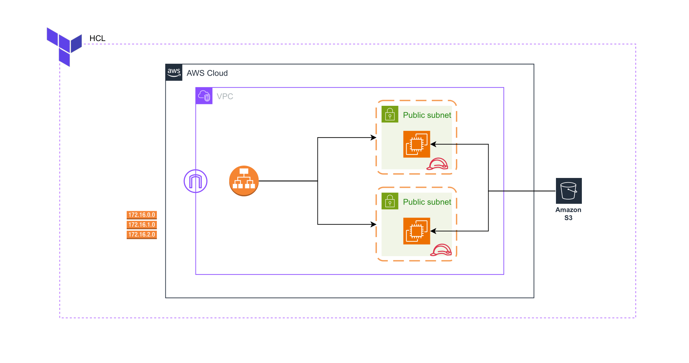

# Terraform-AWS-Project

In This Terraform AWS project! I automated AWS infrastructure using Terraform to deploy two applications in different availability zones, set up a VPC, and configure a load balancer to handle traffic seamlessly.

TERRAFORM WITH AWS PROJECT
Automating Infrastructure and Creating Resources on AWS.

We used Terraform to:

- **Create a Virtual Private Cloud (VPC) with subnets in different availability zones.**
- **Deploy two EC2 instances, each in a separate subnet.**
- **Set up a load balancer to distribute traffic between these instances automatically.**

Learn how to use Terraform to automate infrastructure or create resources on AWS.
- Terraform is simple to use if you have a strong foundation in AWS fundamentals.
- Project with CloudChamp focuses on setting up infrastructure using Terraform, including internet gateway, load balancer, public subnet, EC2 instances, and S3 bucket.

[21:52]([21:52](https://www.youtube.com/watch?v=Koabqyopqns&t=1312)) Terraform automates infrastructure on AWS
- Configuration options for AWS provider can be specified in Terraform
- Hard-coded conditions are not recommended in Terraform configuration, access keys are set using AWS configure command

[32:48]([32:48](https://www.youtube.com/watch?v=Koabqyopqns&t=1968)) Defining VPC and Subnet in Terraform
- Define VPC ID as AWS VPC.myVPC.ID
- Define CIDR block as 10.0.0.0/24
- Specify AZ as US East 1A
- Set map public IP on launch to true
- Create another subnet with different name and CIDR block

[43:44]([43:44](https://www.youtube.com/watch?v=Koabqyopqns&t=2624)) Creating a security group in AWS with inbound rules for ports 80 and 22
- Use the AWS security group resource
- Define the name and prefix of the security group as 'web_HG'
- Specify inbound rules for ports 80 and 22

[54:40]([54:40](https://www.youtube.com/watch?v=Koabqyopqns&t=3280)) Creating and configuring a security group and EC2 instance.
- Modifying and customizing the security group settings.
- Defining the AMI, instance type, security group, subnet, and user data for the EC2 instance.

[1:05:36]([1:05:36](https://www.youtube.com/watch?v=Koabqyopqns&t=3936)) Creating two instances in different security groups and AZs
- Instances are created with a user data script
- Instance metadata can be accessed to get instance ID

[1:27:23]([1:27:23](https://www.youtube.com/watch?v=Koabqyopqns&t=5243)) Creating load balancer and target group using Terraform
- To print load balancer DNS after Terraform execution, use outputs.tf file
- Ensure tags are correctly added and remove any unnecessary tags
- Run Terraform validate and Terraform fmt commands for code validation and formatting
- Execute Terraform plan command to see the resources that will be created
- Run Terraform apply-auto-approve command to start creating load balancer and target group
- Wait for load balancer and target group to become active and healthy
- Make sure the load balancer is associated with the target group and has a load balancer DNS
- After successful setup, test the load balancer by accessing the deployed application
- DevOps engineers can use this project for deploying instances, load balancing, and allowing external access
- Integrate Ansible with Terraform for more complex setups
- Avoid pushing state files to GitHub, and delete resources after completion using Terraform destroy command
